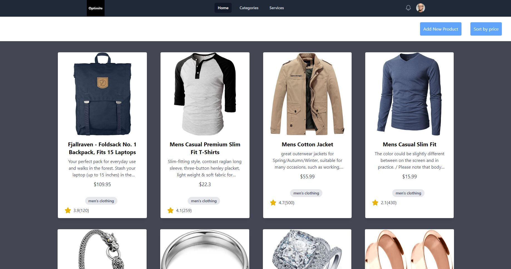

# OTIMITE-REACT-APP



Here is Home Page

<p align="center">
  
</p>

Add New Product

<p align="center">
  
</p>

Add Sort Product

<p align="center">
  
</p>


## Tech Stack

- **(Frontend)**: React.js, Redux and Tailwind CSS


## Overview

This is web application built using React.js for the frontend . It Fetchs data from API and store it in ```REDUX STORE``` and display it to the UI.

## Features

1. Can Add New Product.
2. Short the Product according to the Price.
3. Responsive Design.
4. Can view product page by clicking the Product on Home Page.


